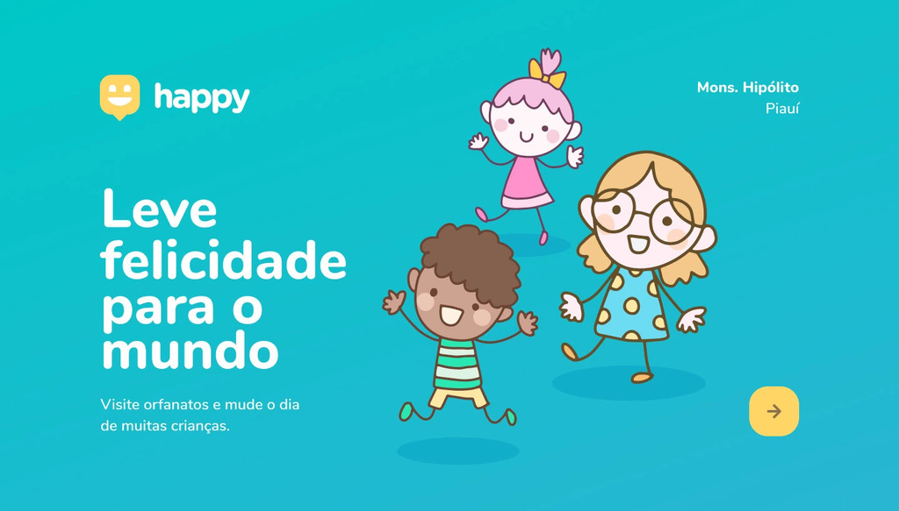

<p align="center">
  
</p>

## 📋 Sumário

- [📋 Sumário](#-sumário)
- [📖 Sobre](#-sobre)
- [👁 Pré-visualização](#-pré-visualização)
  - [🌐 Front-End Web](#-front-end-web)
- [⚙ Como executar o projeto](#-como-executar-o-projeto)

## 📖 Sobre

Esse projeto foi desenvolvido durante a Next Level Week - Edição #3, da Rocketseat.

Tal projeto tem como objetivo promover visitas a orfanatos, tornando a vida das crianças, e de quem visita, muito mais alegre!

## 👁 Pré-visualização

### 🌐 Front-End Web




## ⚙ Como executar o projeto

```sh
# Clone o repositório:
git clone https://github.com/DarkTechLC/happy-nlw3.git

# Mude para o repositório clonado:
cd happy-nlw3

# Para executar o Back-End:
## Na raiz do projeto, vá para o diretório `backend`:
cd backend

## Instale as dependências:
npm install

## Execute as migrations do banco de dados:
npm run typeorm migration:run

## Rode o servidor:
npm run dev

# Para executar o Front-End Web:
## Na raiz do projeto, vá para o diretório `web` , instale as dependências e inicíe-o:
cd web && npm install && npm start
```
