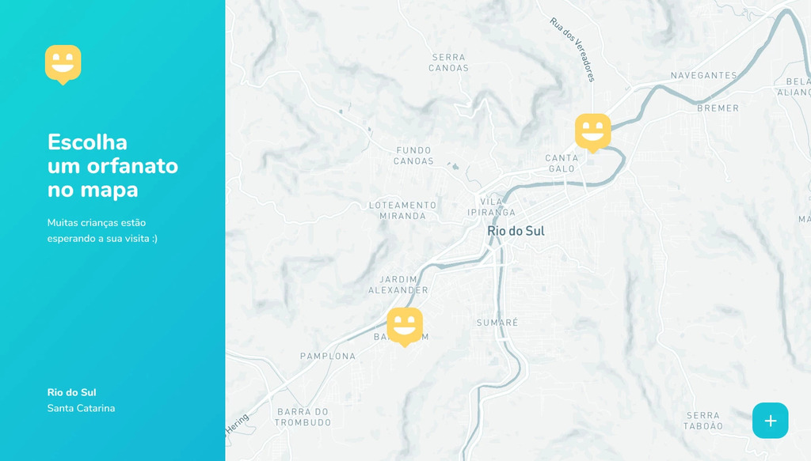
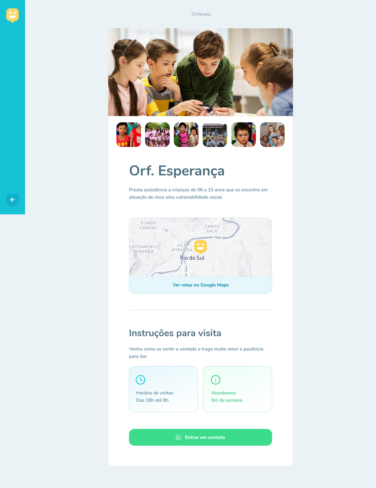
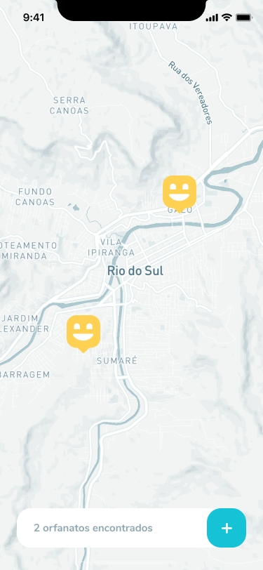

<p align="center">
  
</p>

## 📋 Sumário

- [📋 Sumário](#-sumário)
- [📖 Sobre](#-sobre)
- [👁 Pré-visualização](#-pré-visualização)
  - [🌐 Front-End Web](#-front-end-web)
  - [📱 Front-End Mobile](#-front-end-mobile)
- [🛠 Tecnologias utilizadas](#-tecnologias-utilizadas)
- [⚙ Como executar o projeto](#-como-executar-o-projeto)

## 📖 Sobre

Esse projeto foi desenvolvido durante a Next Level Week - Edição #3, da Rocketseat.

Tal projeto tem como objetivo promover visitas a orfanatos, tornando a vida das crianças, e de quem visita, muito mais alegre!

## 👁 Pré-visualização

### 🌐 Front-End Web

<p align="center">
  
</p>

<p align="center">
  
</p>

<p align="center">
  
</p>

### 📱 Front-End Mobile

<p align="center">
  
</p>

<p align="center">
  
</p>

## 🛠 Tecnologias utilizadas

- [NodeJS](https://nodejs.org/)
- [ReactJS](https://reactjs.org/)
- [ReactNative](https://reactnative.dev/)
- [TypeScript](https://www.typescriptlang.org/)

## ⚙ Como executar o projeto

- Clone o repositório:

  ```sh
  git clone https://github.com/DarkTechLC/happy-nlw3.git
  ```

- Mude para o diretório do repositório clonado:

  ```sh
  cd happy-nlw3
  ```

- Para executar o Back-End:

  - Na raiz do projeto, vá para o diretório `backend`:

    ```sh
    cd backend
    ```

  - Instale as dependências:

    ```sh
    npm install
    ```

  - Execute as migrations do banco de dados:

    ```sh
    npm run typeorm migration:run
    ```

  - Rode o servidor:

    ```sh
    npm run dev
    ```

- Para executar o Front-End Web

  - Na raiz do projeto, vá para o diretório `web` , instale as dependências e inicíe-o:

    ```sh
    cd web && npm install && npm start
    ```

- Para executar o Front-End Mobile

  - Na raiz do projeto, vá para o diretório `mobile`, instale as dependências e inicíe-o:

    ```sh
    cd mobile && npm install && npm start
    ```

  - Instale o `Expo Client` na loja de aplicativos do seu celular ou emulador.
